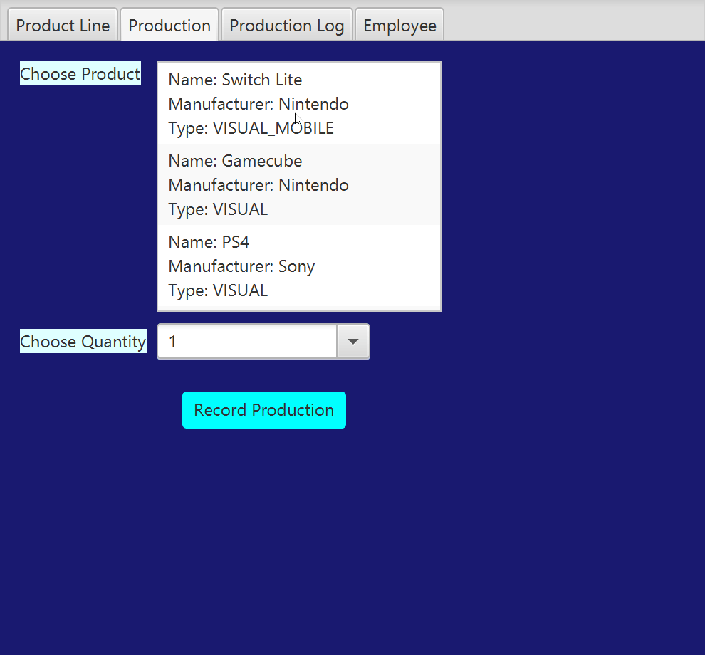

# ProductLineOOPFXDb
My Weekly Updated OOP Project
## Project Title
ProductLineOOPFXDb

## Demonstration

## Documentation
[The Program's JavaDoc](ZStrikeXIII.github.io/ProductLineOOPFXDb/docs/index) YourGitHubUserName.github.io/YourRepositoryName/foldername/filename
## Diagrams

## Getting Started
To begin, download the program and open the jar file. Once you're in the main program, you can type in a product name and manufacturer, and choose one of four product types, and then click the Add Product button for your product to be added to the database. You will see your product in the table below. On the Product List tab, you can click any product in the list, select a quantity, and Record Production to add your selected quantity of products into the Production Log tab, each with their own Serial Numbers. In the Employee tab, you can enter your name and a password for the program to create your own username and email. A default password will also be provided if your password is considered invalid by the program.
## Built With
IntelliJ IDEA
SceneBuilder

## Contributing
You can contribute to this project by helping cut down on code while keeping its functionality, so it is less cluttered and more orderly.
## Author
Jackson Turner

## License

## Acknowledgments
People Who Helped: Professor Scott Vanselow, Kristy Low, Nicholas Hansen
Websites Utilized: Oracle, Stack Overflow. 
## History
Since the Alpha submission, multiple classes have been added weekly as "Issues." Add Product functionality has been added that allows the product(s) to be seen in a table. The Produciton Log will now display the added product along with the selected quantity from the Production tab. As of the "Beta" submission, an Employee class has been added. The Production Log code has also undergone a major overhaul to make it work and display properly. This includes Serial Numbers being generated for each product added, and each product now displaying individually in the log.
## Key Programming Concepts Utilized
- Regular Expressions
- Using SceneBuilder to make a GUI
- Object Oriented Programming
- Overriding and Overloading methods
- Creating a professional README
- Database Coding and Integration
- Using Interfaces and Enums
- Utilizing Abstract Types
- Inheritance
- Polymorphism
- Encapsulation
- ArrayLists
- Lambda Expressions
